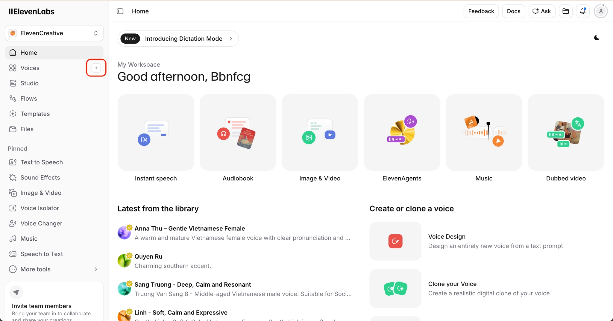
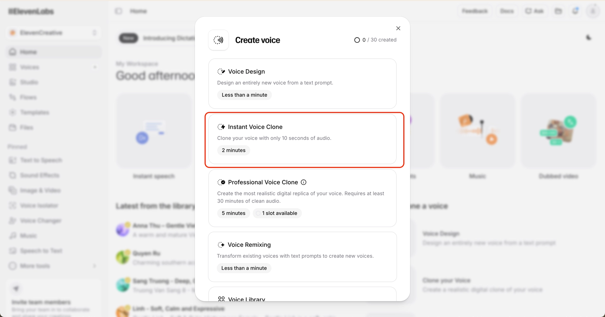
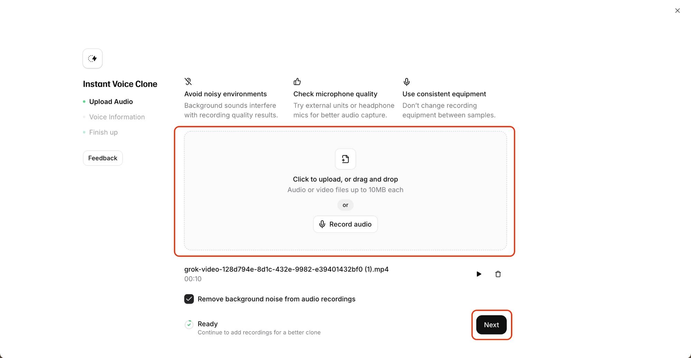
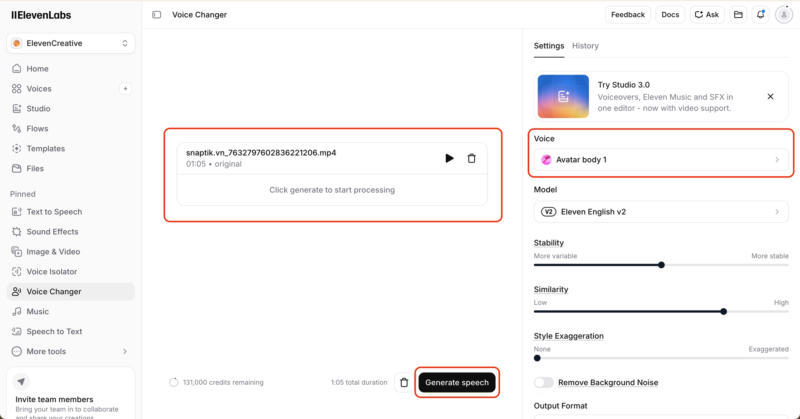

# Phương pháp Voice Changer bằng Elevenlabs

## 1. Tổng thể về phương pháp

Phương pháp này được sử dụng để giải quyết một trong những vấn đề phổ biến nhất khi sản xuất AI video bằng Grok Super Heavy: sự thiếu đồng nhất về chất giọng giữa nhiều clip 10 giây được generate riêng lẻ. 

Về tổng thể, phương pháp này cho phép bạn xây dựng một hồ sơ giọng nói (voice profile) duy nhất từ đoạn clip 10s có chất giọng tốt nhất của nhân vật, sau đó sử dụng tính năng Voice Changer của ElevenLabs để thay thế toàn bộ audio gốc của video đã được ghép từ nhiều clip 10 giây khác nhau. Kết quả cuối cùng là bạn sẽ có một đoạn âm thanh hoàn chỉnh với chất giọng đồng bộ tuyệt đối xuyên suốt toàn bộ video, trong khi vẫn giữ nguyên nhịp nói, timing và cảm xúc của bản ghi gốc.

Đây hiện là một trong những workflow hiệu quả và được sử dụng nhiều trong quá trình sản xuất content của các top creator với tần suất tạo content từ 4-10 video/ ngày.

## 2. Điều kiện cần để sử dụng phương pháp này

Để triển khai phương pháp này, bạn cần chuẩn bị đầy đủ các điều kiện sau:

- Bạn cần có một tài khoản ElevenLabs trả phí (chi phí khoảng 300.000 VNĐ/tháng).
- Bạn cần có một đoạn clip dài chính xác 10 giây với chất giọng của nhân vật mà bạn cảm thấy phù hợp và ưng ý nhất.
- Bạn cần hoàn thiện việc ghép video từ các clip 10 giây được generate bởi Grok trước đó. Ở giai đoạn này, bạn không cần quan tâm đến việc giọng nói giữa các clip bị lệch tone hoặc thiếu đồng nhất, miễn là video đã được dựng hoàn chỉnh thành một bài nói liền mạch của nhân vật.

## 3. Quy trình thực hiện

### Bước 1: Ghép hoàn thiện video

Như đã đề cập ở trên, sau khi có danh sách các clip 10 giây được generate từ Grok, bạn cần sử dụng CapCut để ghép toàn bộ các clip rời rạc này thành một video hoàn chỉnh.

Ở bước này, bạn không cần xử lý vấn đề voice consistency. Mục tiêu duy nhất là đảm bảo:

- Nội dung được nối liền mạch.
- Nhân vật hoàn thành toàn bộ bài nói.
- Nhịp dựng và pacing giữa các clip đủ tự nhiên.
- Timing tổng thể của video được hoàn thiện chính xác.

Đây là bước hoàn thiện “visual storytelling” trước khi xử lý “audio consistency”.

Sau khi hoàn thành, hãy export video về máy với chất lượng thấp nhất để sử dụng làm nguyên liệu đầu vào cho các bước tiếp theo.

### Bước 2: Tạo hồ sơ giọng nói chuẩn cho video

Ở bước này, bạn cần truy cập ElevenLabs và chọn tab **“Voices”** ở thanh công cụ bên trái màn hình. Sau đó, bấm vào biểu tượng dấu cộng để mở giao diện tạo hồ sơ giọng nói mới.

Hệ thống sẽ hiển thị nhiều phương pháp tạo voice profile khác nhau. Tại đây, bạn cần chọn tính năng **“Instant Voice Clone”** — đây là công nghệ cho phép ElevenLabs phân tích và tái tạo giọng nói từ một đoạn audio hoặc video ngắn, thay vì tạo giọng bằng text prompting như các phương pháp truyền thống.

Tiếp theo, hãy chuẩn bị sẵn đoạn clip 10 giây từ Grok mà trong đó nhân vật có chất giọng bạn đánh giá là phù hợp nhất. Đây sẽ là “voice reference” chính cho toàn bộ workflow phía sau.

Sau đó:

- Upload đoạn clip này vào khu vực **“Click to upload or drag and drop”**.
- ElevenLabs sẽ tự động phân tích voice pattern, âm sắc, tone, nhịp nói và đặc điểm vocal của nhân vật.
- Sau quá trình phân tích, hệ thống sẽ tạo ra một hồ sơ giọng nói có khả năng tái sử dụng cho các nội dung khác trong tương lai.

Lưu ý: hồ sơ giọng nói này không chỉ dùng cho video hiện tại, mà còn có thể trở thành “signature voice” cho toàn bộ hệ thống AI character của bạn về sau.

Sau khi hoàn tất phân tích:

- Bấm **“Next”** để tiếp tục.
- Đặt tên cho hồ sơ giọng nói.
- Chọn **Language Value = English**.
- Sau đó bấm **“Save Voice”** để lưu lại.

Khi hoàn thành bước này, bạn đã tạo thành công voice profile chuẩn cho nhân vật của mình.

### Bước 3: Thay đổi hồ sơ giọng nói cho toàn bộ video

Đây là bước quan trọng nhất trong toàn bộ workflow.

Tại thanh công cụ bên trái của ElevenLabs, hãy chọn tính năng **“Voice Changer”**. Đây là tính năng cho phép thay thế giọng nói trong một file audio/video có sẵn bằng một hồ sơ giọng nói khác, trong khi vẫn giữ nguyên:

- Timing
- Pacing
- Nhịp nói
- Ngắt nghỉ
- Biểu cảm tổng thể của đoạn thoại gốc

Ở màn hình tiếp theo:

- Upload video hoàn chỉnh mà bạn đã ghép ở Bước 1.
- Tại mục **Voice**, chọn hồ sơ giọng nói mà bạn vừa tạo ở bước trước.

Sau khi chọn thành công:

- Bấm nút **“Generate speech”**.
- Hệ thống sẽ bắt đầu xử lý và trả về một file audio (.mp3).

File audio này sẽ giữ nguyên toàn bộ cách nhân vật nói trong video gốc, nhưng toàn bộ giọng nói giờ đây sẽ được chuyển thành một chất giọng đồng nhất duy nhất — chính là voice profile bạn đã tạo trước đó.

Đây chính là bước giúp video AI của bạn chuyển từ cảm giác “ghép nhiều clip rời rạc” sang cảm giác một chất giọng duy nhất xuyên suốt toàn bộ video.

<aside>
💡

Lưu ý: Kết quả ở bước này mới chỉ là một file audio mp3, tức là một file âm thanh không có hình ảnh. Bạn vẫn cần thực hiện bước 4 để đổi giọng cho toàn bộ video của bạn.

</aside>

### Bước 4: Thay audio giọng nói vào video trên Capcut

Sau khi đã có file audio chuẩn từ ElevenLabs, bước cuối cùng là đồng bộ audio mới này với video trong CapCut.

Tại đây:

- Upload file mp3 vừa generate vào project trên Capcut.
- Chọn toàn bộ video và sử dụng chức năng **Mute Video** để tắt hoàn toàn audio gốc.
- Sau đó thêm file mp3 mới vào timeline video.

Khi hoàn thành bước này, bạn sẽ có một video với:

- Hình ảnh giữ nguyên từ các clip Grok ban đầu.
- Voice consistency hoàn toàn đồng bộ.
- Một chất giọng duy nhất xuyên suốt toàn bộ video.
- Trải nghiệm nghe tự nhiên và chuyên nghiệp hơn rất nhiều.