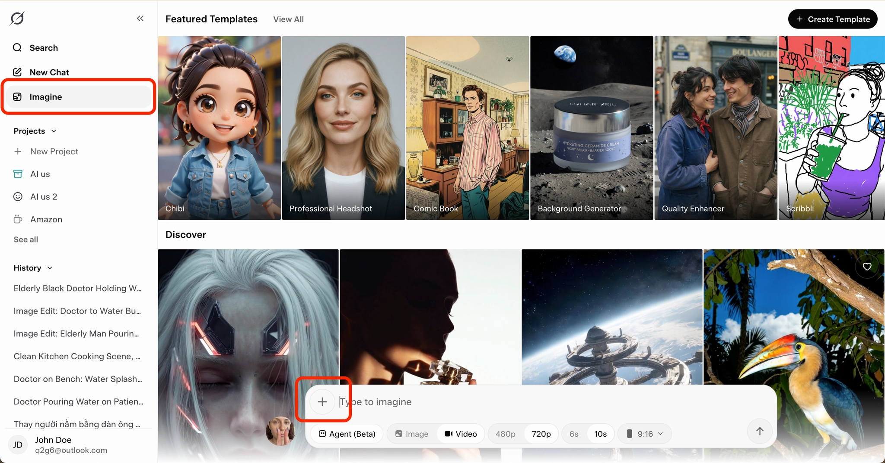
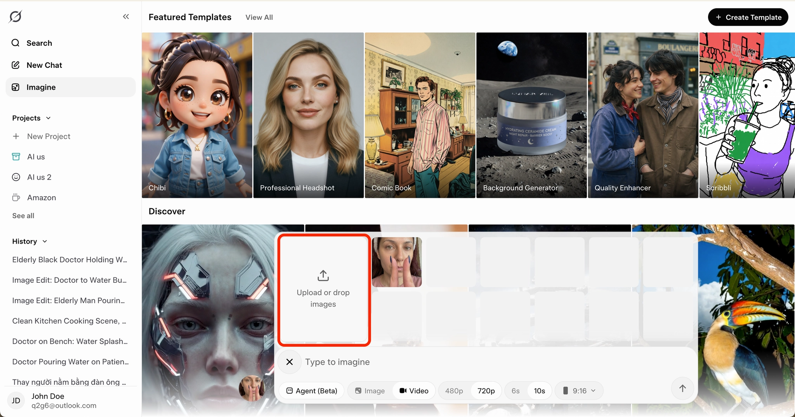
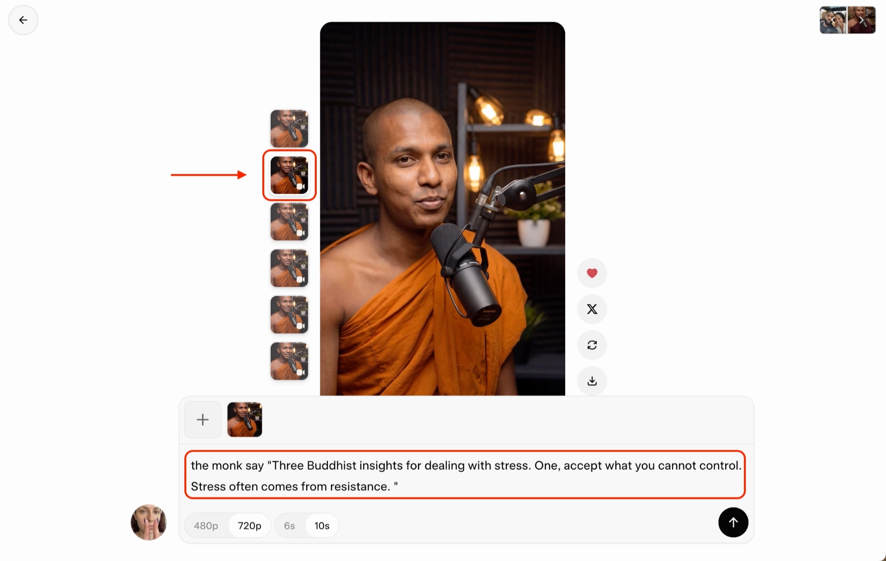

# Tạo body video bằng Grok Super Heavy

## 1. Mục đích của tài liệu này

Trong đa số các tool tạo video đang có ngoài thị trường, chúng ta sẽ luôn thấy Veo luôn là sự lựa chọn hàng đầu vì chất lượng video và giá thành của nó. Tuy nhiên, điều này lại chính là con dao 2 lưỡi dẫn đến việc Veo hay bị quá tải và lỗi gen video. Đây sẽ là thứ mà bạn sẽ phải sống chung nếu bạn không có budget tốt và một phương án dự phòng khác. 

Nhưng đương nhiên với đại đa số chúng ta thì thời gian là vàng. Nên nếu bạn sẵn sàng bỏ ra hơn 1 triệu mỗi tháng cho tool tạo video thì chúng ta sẽ có một phương án dự phòng tiếp theo đó là Grok Super Heavy. Lý do Grok free và Grok Super không được nhắc đến thì đương nhiên là vì chất lượng của 2 model này kém hơn hẳn so với Veo nên hôm nay chúng ta sẽ chỉ nói đến Grok Super Heavy. Đánh giá sơ bộ về phương án này:

- Chất lượng: 9/10 ⭐
- Độ ổn định: 10/10 ⭐
- Khả năng tạo nhiều video cùng một lúc: 10/10 ⭐
- Không lỗi vặt: 10/10 ⭐

Nên nếu bạn cảm thấy bị mất quá nhiều thời gian do lỗi và sự không ổn định của Veo, đây là tài liệu bạn cần đọc.

Điều kiện đầu vào: Bạn cần có tài khoản Grok đăng ký Super Heavy

<aside>
💡

Tài liệu này được xây dựng với mục tiêu: Hướng dẫn bạn **sử dụng Grok Super Heavy** để tạo được: Phân cảnh Body

</aside>

## 2. Quy trình chi tiết từng bước

### Bước 1. Chuẩn bị nguyên liệu trước khi tạo video

Để tạo được body video bằng Veo, bạn chỉ cần **hai nguyên liệu bắt buộc**:

- Hình ảnh AI của avatar body: Hãy tạo ảnh bằng Flow Veo vì Nano Banana Pro có chất lượng ảnh tốt hơn rất nhiều so với model của Grok. Và đảm bảo bạn tải ảnh xuống với chất lượng 4K. Chất lượng đầu vào càng tốt thì kết quả đầu ra của Grok càng tốt.
- Kịch bản hội thoại.

### Bước 2. Chia nhỏ script theo giới hạn 10 giây của Grok

Khác với Veo, Grok có giới hạn mỗi video tối đa **10 giây**, vì vậy mọi script body có độ dài trung bình hoặc dài đều **bắt buộc phải chia nhỏ**, nhưng đương nhiên 10 giây mỗi clip sẽ giảm cho bạn rất nhiều công sức so với 8 giây

Ở bước này, bạn mở ChatGPT và sử dụng prompt:

```jsx
Break down this script to each 10s length video [paste script vào đây]
```

Việc chia nhỏ script không chỉ để phù hợp với giới hạn thời lượng, mà còn giúp:

- Dễ kiểm soát chất lượng từng đoạn video
- Giảm rủi ro video bị lỗi biểu cảm ở nửa sau
- Dễ chỉnh sửa hoặc thay thế nếu một đoạn gen không đạt yêu cầu

<aside>
💡

Mẹo để giữ tốc độ nói đều giữa các clip 10s: Hãy check thủ công và chỉnh sửa các đoạn hội thoại chia nhỏ trên để đảm bảo số lượng từ trong mỗi đoạn hội thoại chia nhỏ luôn bằng nhau (khoảng 32-36 từ). Tốc độ nói của nhân vật sẽ bị ảnh hưởng bởi số lượng từ trong đoạn hội thoại, thoại ngắn thì nói chậm, thoại dài thì nói nhanh.

</aside>

### Bước 3. Tạo prompt video cho body

Sau khi script đã được chia nhỏ, bạn tiếp tục sử dụng ChatGPT để tạo prompt cho Grok.

Cũng giống như tạo bằng Veo, body video **không yêu cầu prompt phức tạp**. Bạn chỉ cần một prompt ngắn, tập trung vào việc nhân vật nói chuyện.

Prompt mẫu:

```jsx
Give me a short grok video generation prompt to create a video in which the avatar says [paste đoạn script đầu tiên vào đây]. Always mention "The shot remains stable. No zoom in/out. No background and theme music"
```

Một điểm quan trọng cần nhớ là:

Bạn **chỉ cần tạo prompt một lần** và sử dụng prompt này cho toàn bộ các đoạn script còn lại. Ở mỗi video, bạn chỉ cần thay đổi **phần hội thoại**, không cần viết lại prompt mới. Lý do là vì body video không tập trung vào hành động hay kịch tính hình ảnh, mà ưu tiên sự ổn định và đồng nhất.

### Bước 4. Tạo video trong Grok

Sau khi đã có prompt, bạn mở **Grok** và chọn **Imagine**.

Tại đây, trên thanh thiết lập thông số và nhập prompt bạn cần thiết lập thông số như sau:

- Chọn chế độ Video
- Chọn chế độ **720p** (Chất lượng video tối đa Grok cho phép, đây sẽ không phải vấn đề nếu ảnh đầu vào của bạn là 4K)
- Chọn chế độ **10s**
- Chọn chế độ khung hình **9:16**

(Output mặc định của Grok luôn là 1)



### Bước 5. Upload ảnh start frame vào để bắt đầu tạo video

Khác với Veo, Grok không có cơ chế thêm ảnh End frame mà chỉ có Start frame, tuy nhiên điểm hay của Grok là nếu bạn không yêu cầu nhân vật có hành động bất thường trong video thì nhân vật sẽ chỉ tập trung vào nói và sử dụng ngôn ngữ hình thể. Điều này giải quyết được vấn đề cố hữu của Veo khi hay tự động tạo ra các hành động bất thường nếu không có End frame. 

Hãy upload ảnh avatar body của bạn vào vị trí khoanh đỏ có chữ “Upload or drop images” này.



Sau khi upload ảnh xong, hãy nhập prompt của bạn vào ô điền prompt và bắt đầu gen video

### Bước 6. Tạo các clip tiếp theo

Sau khi tạo xong clip đầu tiên, bạn sẽ cần tạo các clip 10s tiếp theo cho tới khi đủ toàn bộ một video hoàn chỉnh. Tuy nhiên khác với Veo, chúng ta sẽ không sử dụng tính năng Extend của Grok. Mặc dù Grok đã có tính năng Extend video tuy nhiên chất lượng đang vô cùng thấp nên thời điểm này chúng ta sẽ làm theo cách dưới đây

Trước tiên, luôn chọn video đầu tiên mà bạn tạo ra. Sau đó bấm vào ô nhập prompt của video này (vùng khoanh đỏ) và nhập prompt tạo video của clip 10s tiếp theo. Rồi bấm Enter

Lặp lại thao tác này với tất cả các clip 10s tiếp theo cho đến khi hoàn thành video của bạn

<aside>
💡

Lưu ý: Vì đây là cách để tạo ra các clip độc lập với nhau thay vì các clip extend từ clip gốc, nên giọng của nhân vật sẽ có 40% tỷ lệ khác với giọng của clip gốc. Bạn có thể lặp lại thao tác trên với prompt tương tự để tạo ra 1 clip khác cho đến khi có được clip có giọng bạn ưng nhất.
Tuy nhiên, có một phương pháp là Voice Changer bằng Elevenlabs để giải quyết vấn đề này một cách hiệu quả. Và phương pháp này phù hợp nếu bạn cần làm số lượng lớn video một ngày (3-6 video) vì nó rất tiết kiệm thời gian. 

</aside>



### Bước 7. Tải video và ghép hoàn chỉnh

Sau khi video được tạo xong, bạn tải video xuống.

Tiếp theo, sử dụng **CapCut** để:

- Ghép các video theo đúng thứ tự script
- Cắt bỏ những đoạn thừa không cần thiết
- Điều chỉnh nhịp độ nếu cần, nhưng không làm mất sự tự nhiên của giọng nói
- Điều chỉnh giọng bằng phương pháp Voice Changer nếu cần

Bước cuối cùng – và rất quan trọng – là gửi **video body hoàn chỉnh** cho coach để nhận feedback.