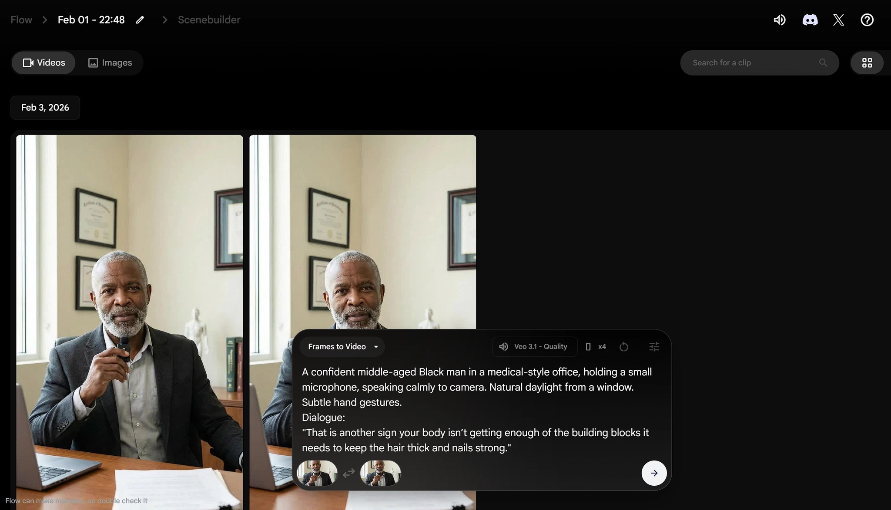
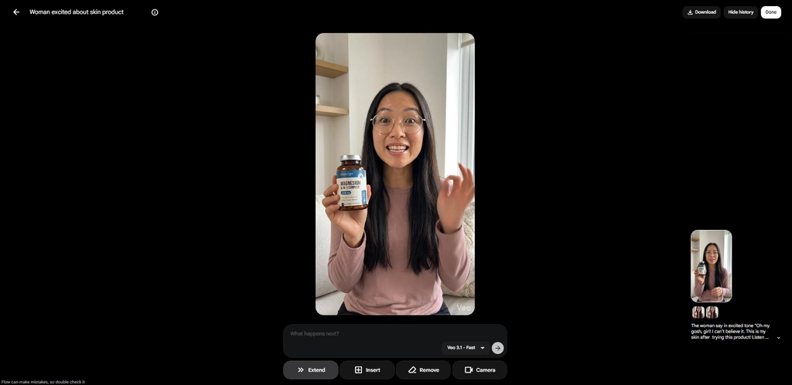
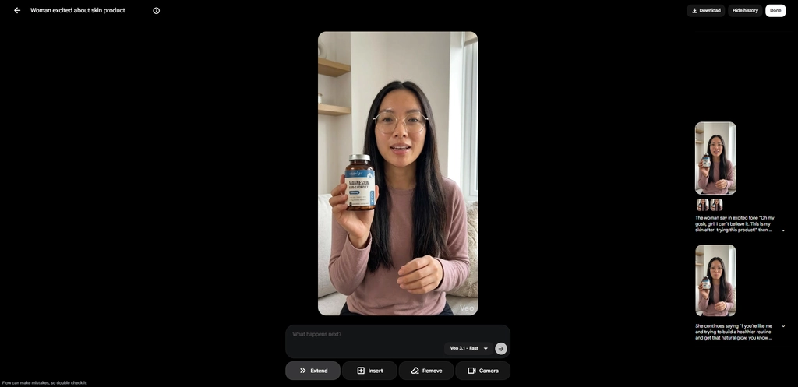
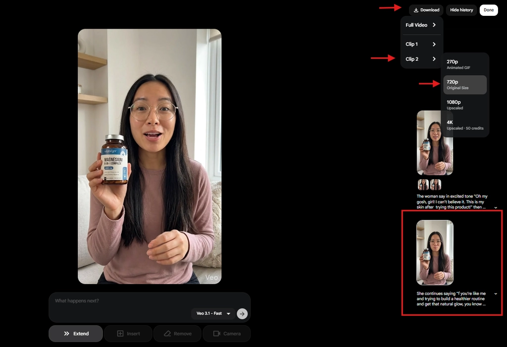
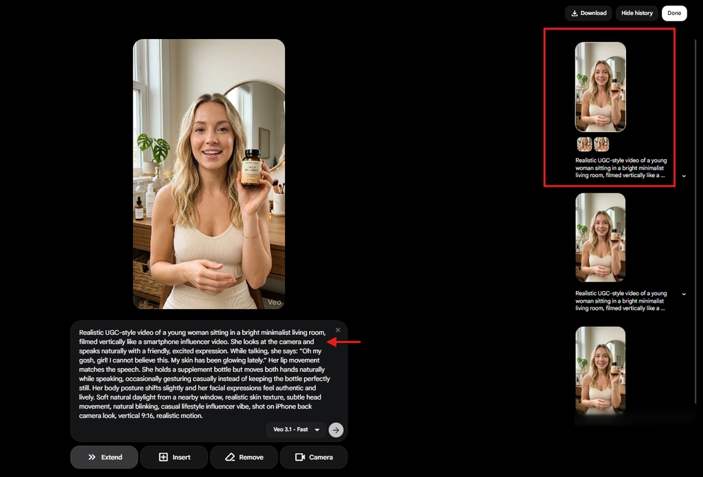

# Tạo body video bằng Flow Veo

## 1. Mục đích của tài liệu này

Tài liệu này được xây dựng với mục tiêu:

- Hướng dẫn bạn **sử dụng Veo** để tạo được: Phân cảnh Body
- Theo **đúng tư duy, đúng quy trình, đúng tiêu chuẩn của coach**

Tài liệu này **không chỉ là hướng dẫn thao tác**, mà còn giúp bạn hiểu:

- Vì sao phải làm như vậy
- Vì sao không nên làm cách khác
- Và làm sao để tránh những lỗi beginner thường mắc

Điều kiện đầu vào: Bạn cần có tài khoản Flow Veo Ultra 45K credit

## 2. Quy trình chi tiết từng bước

Phân cảnh body là **xương sống của toàn bộ video affiliate**. Đây là nơi nhân vật AI trực tiếp truyền tải thông điệp tới người xem, giải thích vấn đề và dẫn dắt hành động mua hàng.

Khác với prehook – nơi hình ảnh và hành động được ưu tiên để giữ chân người xem trong vài giây đầu – body video tập trung nhiều hơn vào **nội dung hội thoại và cảm xúc khi nói**.

Vì vậy, khi tạo body bằng Veo, mục tiêu không phải là tạo ra quá nhiều hành động phức tạp, mà là làm sao để nhân vật:

- Nói tự nhiên
- Biểu cảm ổn định
- Đồng nhất xuyên suốt toàn bộ video

### Bước 1. Chuẩn bị nguyên liệu trước khi tạo video

Để tạo được body video bằng Veo, bạn chỉ cần **hai nguyên liệu bắt buộc**:

Hình ảnh AI của avatar body và kịch bản hội thoại.

### Bước 2. Chia nhỏ script theo giới hạn 8 giây của Veo

Veo có giới hạn mỗi video tối đa **8 giây**, vì vậy mọi script body có độ dài trung bình hoặc dài đều **bắt buộc phải chia nhỏ**.

Ở bước này, bạn mở ChatGPT và sử dụng prompt:

```jsx
Break down this script to each 8s length video [paste script vào đây]
```

Việc chia nhỏ script không chỉ để phù hợp với giới hạn thời lượng, mà còn giúp:

- Dễ kiểm soát chất lượng từng đoạn video
- Giảm rủi ro video bị lỗi biểu cảm ở nửa sau
- Dễ chỉnh sửa hoặc thay thế nếu một đoạn gen không đạt yêu cầu

<aside>
💡

Mẹo để giữ tốc độ nói đều giữa các clip 10s: Hãy check thủ công và chỉnh sửa các đoạn hội thoại chia nhỏ trên để đảm bảo số lượng từ trong mỗi đoạn hội thoại chia nhỏ luôn bằng nhau (khoảng 14-16 từ). Tốc độ nói của nhân vật sẽ bị ảnh hưởng bởi số lượng từ trong đoạn hội thoại, thoại ngắn thì nói chậm, thoại dài thì nói nhanh.

</aside>

### Bước 3. Tạo prompt video cho body

Sau khi script đã được chia nhỏ, bạn tiếp tục sử dụng ChatGPT để tạo prompt cho Veo.

Khác với prehook, body video **không yêu cầu prompt phức tạp**. Bạn chỉ cần một prompt ngắn, tập trung vào việc nhân vật nói chuyện.

Prompt mẫu:

```jsx
Give me a short Veo video generation prompt to create a video in which the avatar says [paste đoạn script đầu tiên vào đây]. Always mention "The shot remains stable. No zoom in/out. No background and theme music"
```

Một điểm quan trọng cần nhớ là:

Bạn **chỉ cần tạo prompt một lần** và sử dụng prompt này cho toàn bộ các đoạn script còn lại. Ở mỗi video, bạn chỉ cần thay đổi **phần hội thoại**, không cần viết lại prompt mới.

Lý do là vì body video không tập trung vào hành động hay kịch tính hình ảnh, mà ưu tiên sự ổn định và đồng nhất.

### Bước 4. Tạo video trong Flow Veo

Sau khi đã có prompt, bạn mở **Flow Veo** và chọn **New Project**.

Tại đây, bạn thiết lập các thông số video như sau:

- Chọn chế độ **Frames to Video**
- Aspect ratio: **Portrait 9:16**
- Model: **Veo3.1 – Quality**
- Outputs per prompt: **4**

Việc chọn Outputs per prompt là 4 giúp bạn có nhiều phiên bản để so sánh và chọn ra đoạn video tự nhiên nhất, thay vì phụ thuộc vào một kết quả duy nhất.

### Bước 5. Thiết lập Start frame và End frame cho body video

Ở body video, **bạn nên sử dụng cả Start frame và End frame**.

Hãy upload **cùng một ảnh AI** cho cả hai vị trí này.

Lý do là vì body thường gồm nhiều video 8s được ghép lại với nhau. Việc dùng cùng một Start frame và End frame giúp:

- Các đoạn video liền mạch hơn
- Nhân vật không bị thay đổi khuôn mặt hoặc góc nhìn
- Tổng thể video trông như một lần quay liên tục

Đây là bước rất quan trọng để tránh cảm giác “video AI ghép đoạn”.



### Bước 6. Tạo các clips 8s tiếp theo

Sau khi đã có clip gốc, bạn có thể tiếp tục tạo các đoạn video nối tiếp để hoàn thành toàn bộ script bằng tính năng Extend video của Veo

Quy trình này giúp AI:

- giữ cùng giọng nói
- giữ cùng bối cảnh
- giữ cùng nhân vật

Quy trình thao tác:

1. Chọn và click vào video gốc/video hook mà bạn ưng ý nhất (hệ thống sẽ hiện ra màn hình phía dưới
2. Ở ô nhập prompt phía dưới video, hãy paste đoạn prompt số 2 trong 3 đoạn prompt tạo video mà chatgpt cung cấp cho bạn ở bước 1
3. Thay thế đoạn script trong prompt mẫu bằng câu tiếp theo (sau câu hook) từ đoạn script của bạn vào “…”



3. Sau khi generate video extend thành công, bên cột tay phải sẽ xuất hiện thêm 1 video extend từ video gốc



4. Bấm vào video extend vừa tạo, và chọn tải xuống > Clip 2 > Chất lượng 720-1080p là đủ

(Chỉ tải xuống clip 2 vì đây là video extend, còn clip 1 chính là clip gốc mà bạn vừa tạo ở bước 1. Và Full video là đoạn video bao gồm cả 2 clip)



4. Tiếp tục làm tương tự với các câu còn lại trong đoạn script của bạn

<aside>
💡

Lưu ý: bạn luôn phải cuộn lên đầu và bấm chọn video đầu tiên/ video gốc của bạn. Rồi mới tiếp tục paste prompt tạo video vào làm tiếp. Mục đích vì chúng ta luôn phải tạo video extend từ video gốc, để đảm bảo chất lượng hình ảnh và giọng nói. Vì càng đến những video extend sau này, thì chất lượng của video càng đi xuống, dẫn đến ảnh hưởng đến các video extend đằng sau nó

</aside>



Hãy làm tương tự cho đến khi hoàn tất 100% script của bạn và đã tải xuống đủ các clip extend này. Và khi tạo các đoạn extend, hãy nhớ:

- mỗi đoạn chỉ nên **1 câu ngắn dưới 14 từ**
- mỗi đoạn nên hoàn thành **một ý nhỏ trong script**

### Bước 6. Tải video và ghép hoàn chỉnh

Sau khi video được tạo xong, bạn tải video xuống bằng tùy chọn **Upscaled (4K)** để đảm bảo chất lượng hình ảnh tốt nhất.

Tiếp theo, sử dụng **CapCut** để:

- Ghép các video theo đúng thứ tự script
- Cắt bỏ những đoạn thừa không cần thiết
- Điều chỉnh nhịp độ nếu cần, nhưng không làm mất sự tự nhiên của giọng nói

Bước cuối cùng – và rất quan trọng – là gửi **video body hoàn chỉnh** cho coach để nhận feedback.