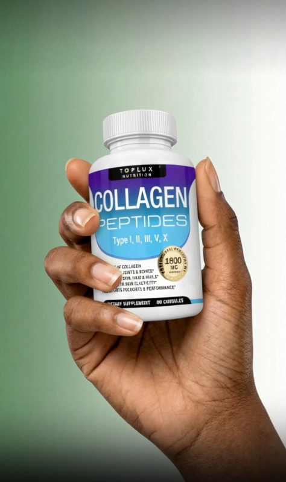

# [NC] Homework - Buổi 1

### **Bối cảnh bài tập**

Trong bài tập này, học viên sẽ được cung cấp 2 sản phẩm mẫu để thực hành. Học viên sẽ được chọn 1 sản phẩm để làm sản phẩm chính để thực hành.

Sau khi đã có sản phẩm chính, học viên sẽ bắt đầu bằng việc xây dựng một nhân vật AI phù hợp với nhóm khách hàng mục tiêu (do học viên tự xác định) mà sản phẩm hướng đến. Việc xác định đúng nhân vật sẽ giúp định hướng toàn bộ nội dung và cách triển khai video.

Sau đó, học viên sẽ phát triển tối thiểu 4 video affiliate gồm phân cảnh body & phân cảnh broll giới thiệu sản phẩm (sẽ được hướng dẫn chi tiết ở phần dưới cho học viên nào chưa biết cách làm). Trong đó 4 video này sẽ cần có đủ 3 loại kịch bản được học, 4 concept và 3 personas cho body avatar.

1. Sản phẩm **LEEFAR Her Juicy Feminine Probiotics Gummies (images\Leefar)**
2. Sản phẩm **Floraviva Rhodiola Rosea Capsules (images\Floraviva)**

## **Bài 1 — Xác định nhân vật & người xem mục tiêu**

Học viên xác định **1 đối tượng người xem mục tiêu mà sản phẩm của mình hướng đến** và mô tả rõ:

- Quốc tịch (US)
- Độ tuổi
- Màu da / ngoại hình
- Lifestyle (healthy, busy, stress,…)
- Vấn đề đang gặp phải
- Mong muốn cải thiện..

<aside>
💡

Gợi ý: Phần xác định chân dung người mua mục tiêu càng rõ thì những phần dưới sẽ càng dễ triển khai

</aside>

## **Bài 2 — Xây dựng định danh nhân vật body (avatar personas)**

Học viên dựa trên nhóm khách hàng mục tiêu nói trên để xác định ra ít nhất 3 định danh nhân vật body tương đương với 3 loại personas đã được dạy. Sau đó:

- Giải thích chi tiết tại sao lại chọn các định danh này? Lợi thế của các loại định danh này với nhóm người xem mục tiêu là gì? Học viên định sử dụng những lợi thế đó trong phần hình ảnh và kịch bản như thế nào?
- Tạo ra hình ảnh minh họa cho các định danh đã xác định ở trên, để làm nguyên liệu xác định hoàn cảnh nhân vật ở dưới

## **Bài 3 — Xây dựng hoàn cảnh cho nhân vật body (avatar concept)**

Tại đây, học viên cần xác định và tạo hoàn cảnh (concept) tương ứng cho các định danh đã xác định ở trên. Trong đó, các hoàn cảnh này phải đủ cả 4 concept đã được dạy trước đó. Sau đó:

- Giải thích chi tiết tại sao lại chọn các hoàn cảnh này?
- Tạo ra hình ảnh cuối cùng cho body avatar của học viên với đầy đủ định danh và hoàn cảnh, để làm nguyên liệu tạo video

## **Bài 4 — Xây dựng kịch bản hoàn chỉnh**

Tạo tối thiểu 4 kịch bản cho 4 video được yêu cầu ở trên, trong đó phải có đủ cả 3 loại kịch bản đã được học. 

Tại đây học viên sẽ cần viết lại kịch bản trên phần cấu trúc đã được hướng dẫn, để kịch bản:

- Phù hợp với sản phẩm
- Phù hợp với nhóm khách hàng mục tiêu (độ tuổi/quốc tịch/giới tính/vấn đề..)
- Phù hợp với body avatar (gồm hoàn cảnh và định danh)

## **Bài 5 — Tạo video hoàn chỉnh**

- Tạo đầy đủ tối thiểu 4 video bằng các nguyên liệu ở trên, gồm kịch bản và hình ảnh body avatar
- Tạo phân cảnh broll giới thiệu sản phẩm và đặt phân cảnh này làm overlay trên đoạn hội thoại nhắc đến sản phẩm
- *Hướng dẫn làm cảnh broll*
    
    Đoạn video B-roll này đóng vai trò như lớp hình ảnh minh họa, giúp người xem thấy rõ sản phẩm trong bối cảnh thực tế, từ đó tăng khả năng ghi nhớ và thuyết phục. 
    
    Các cảnh B-roll trong concept này thường mang phong cách tự nhiên, chân thực và mang tính ứng dụng cao, tập trung vào hành động cầm, quan sát hoặc sử dụng sản phẩm một cách tinh tế, thay vì tạo cảm giác quảng cáo quá lộ liễu. Chủ yếu sẽ là góc quay cận, trong đó nhân vật chỉ quay phần tay giơ lên cầm sản phẩm
    
    - Tạo hình ảnh Broll cầm sản phẩm
        
        Công cụ: Flow Veo → Chức năng tạo ảnh
        
        Hướng dẫn:
        
        - Học viên upload một hình ảnh trực diện của sản phẩm
        - Copy & paste **prompt template 05** dưới đây vào Flow Veo
        - **Prompt template 05**
            
            Photorealistic close-up of a female African-American hand holding a bottle right up to the camera, front label facing perfectly forward. The hand grips naturally from the side with relaxed fingers, neat nails, realistic skin texture and creases. The bottle is vertical, centered, filling ~70% of frame. Even, soft studio lighting (large softbox at 45° + fill) to avoid glare and reflections. Modern simple living background. 50–85 mm lens look, f/5.6 for full label sharpness, no motion blur. Glass edges crisp, liquid visible. Reproduce the exact label text clearly and 100% legible—no warping, no truncation, no misspellings. High resolution, sharp focus, true-to-life colors.
            
        
        
        
    - Tạo video Broll cầm sản phẩm
        
        Công cụ: Flow Veo → Chức năng tạo video
        
        Hướng dẫn:
        
        - Học viên upload một hình ảnh broll cầm sản phẩm đã tạo ở bước trên (Vào cả Start frame và End frame)
        - Copy & paste **prompt template 06** dưới đây vào Flow Veo
        - **Prompt template 06**
            
            ```jsx
            Lock camera. Bottle upright. Subtle idle motion and slightly turn the bottle left and right as if showing the product to the camera.
            ```
            
- Học viên có thể sử dụng cả 3 tool Heygen, Veo và Grok trong quá trình tạo

## Yêu Cầu & Hướng Dẫn Nộp Bài

**Yêu cầu nộp bài:** 

- Nộp đủ kết quả của 6 bài tập bao gồm các file doc giải thích và các file media thành quả (hình ảnh và video)

**Hướng dẫn nộp bài:**

- Sau khi đã hoàn thành, tạo một file Google Drive rồi tải bài tập lên
- Đổi tên file thành tên zalo của học viên
- Cấp quyền xem (View) cho bất cứ ai có link
- Gửi link Google Drive cho coach Alan.